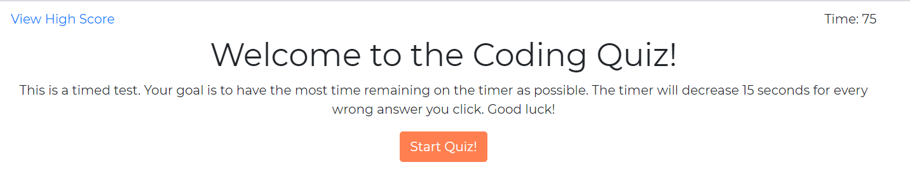
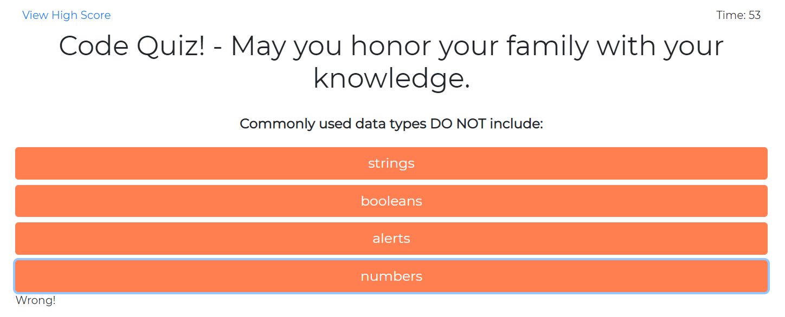
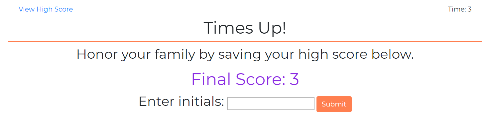

# code_quiz

Welcome to the code Quiz! This is a brief quiz to test you coding knowledge while also testing my coding knowledge! Get the highest score possible and race against your friends. 

This application is made with HTML, CSS, Bootstrap, and Javascript. 

## Instructions
1. When you're ready, hit the start button to begin the quiz.

2. Select the answer you believe is correct. If you get the question wrong, you will lose 15 seconds from the clock. 

3. When you have completed the quiz, enter you initials and hit submit to save your high score. 

4. Refresh the page to take the quiz again.

## Authors

* **Emily Taylor** - *Initial work* - [emilyporterfieldtaylor](https://github.com/emilyporterfieldtaylor)

## License

This project is licensed under the MIT License 

## Acknowledgments

* Tyler Wood - my helpful roommate
* Leandra - for helping me with the local storage bits
